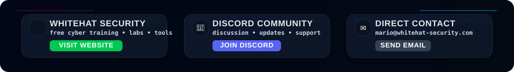

<p align="center">
  
</p>

<p align="center">
  
</p>

<p align="center">
  
  
  
  
  
  
</p>

<p align="center">
  <a href="https://whitehat-security.com">
    
  </a>
</p>

<p align="center">
  <sub>
    <a href="https://whitehat-security.com">whitehat-security.com</a>
    &nbsp;•&nbsp;
    <a href="https://discord.gg/8xHn6Fr">discord</a>
    &nbsp;•&nbsp;
    <a href="mailto:mario@whitehat-security.com">mario@whitehat-security.com</a>
  </sub>
</p>

---

## About

I build public projects, security tooling, and educational cybersecurity material.

Most of my work lives at the boundary between offense and defense: reverse engineering malware, breaking applications and infrastructure, building detections, automating security workflows, and turning attacker tradecraft into practical defensive engineering.

---

## Core Stack

<p align="center">
  
</p>

---

## Security Stack

### Offensive / Research

<p align="center">
  
  
  
  
  
  
  
  
  
  
</p>

### Reverse Engineering / Malware / DFIR

<p align="center">
  
  
  
  
  
  
  
  
  
  
</p>

### Detection / Defense

<p align="center">
  
  
  
  
  
  
  
  
  
  
</p>

### Cloud / AppSec / DevSecOps

<p align="center">
  
  
  
  
  
  
  
  
  
  
</p>

---

## Arsenal

```txt
[ offensive ]
recon          nmap · masscan · amass · subfinder · nuclei · ffuf · gobuster · feroxbuster
web            burp suite · owasp zap · sqlmap · nikto
internal/ad    bloodhound · netexec · impacket · responder · hydra
cracking       hashcat · john the ripper
c2/research    metasploit · cobalt strike · sliver · gophish

[ reverse / malware / forensics ]
static         ida · ghidra · radare2 · pestudio · pe-bear · capa · yara · dnspyex
dynamic        x64dbg · flare-vm · remnux · any.run · cuckoo · virustotal
forensics      volatility · autopsy · timesketch

[ detection / defense ]
endpoint       crowdstrike · sentinelone · carbon black · sysmon · osquery · velociraptor
network        wireshark · tcpdump · zeek · suricata · snort
siem           fortisiem · microsoft sentinel · elastic · splunk · wazuh
intel / ir     sigma · yara · misp · opencti · thehive · cortex

[ cloud / appsec ]
cloud          aws · azure · gcp · cloudflare
infra          kubernetes · rancher · docker · terraform · ansible
ci/cd          github actions · gitlab ci
sast           sonarqube · semgrep
sca / sbom     trivy · grype · syft · snyk
iac / cspm     checkov · kics · tfsec · prowler · scoutsuite · cloudsplaining · steampipe
```

---

## GitHub

<p align="center">
  
  
</p>

---

<p align="center">
  <a href="https://www.buymeacoffee.com/darkarp">
    
  </a>
</p>

<p align="center">
  
</p>
